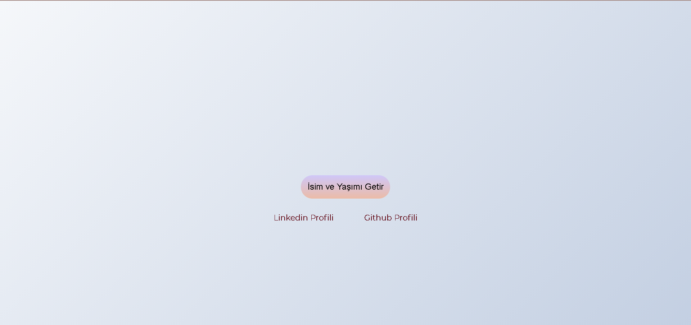
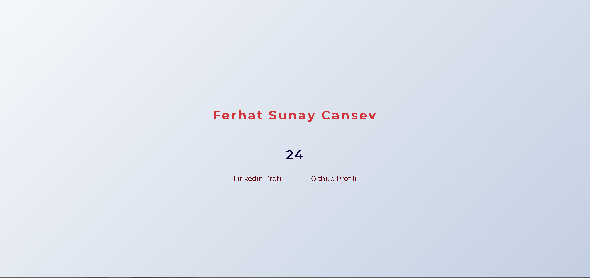

# odev-hafta-1

Github ve Linkedin profillerinizine ulaşabileceğimiz bir web sayfası geliştirmeniz bekleniyor.

## Project Screenshot
Before Click Button

After Click Button

## Kurallar
1- "a"elementinin href attr'si javascript içerisinde oluşturulmalıdır.

2- href attr'lerinin value'ları yine javascript içerisinde set edilmelidir.

3- Getir butonu bir onclick fonksiyonu tetiklemeli ve bu fonksiyon "h1" tag'inin içerisine isminizi, "h2" tag'inin içerisine de yaşınızı yazmalı. Yani butona tıklandığında DOM'da isminiz ve görülebilir olmalı.

4- Style konusunda tamamen özgürsünüz, görünüm size kalmış :)

5- Dosya isimleri aşağıda belirtildiği gibi olabilir.

    index.html
    index.js

